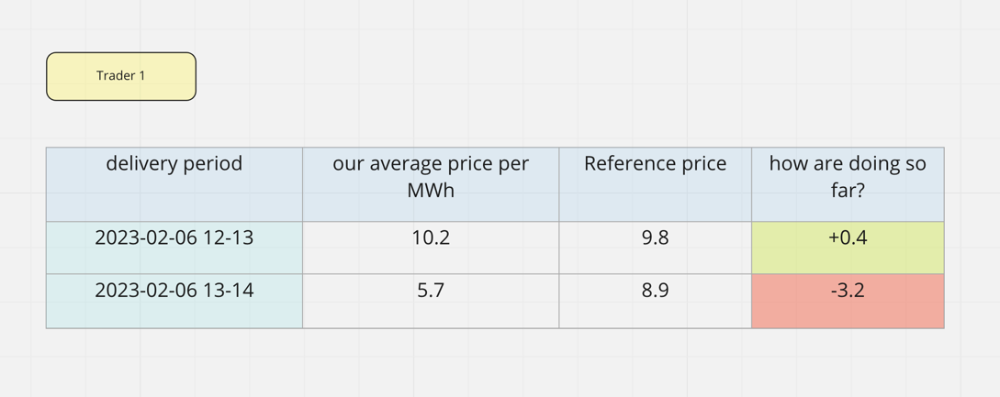
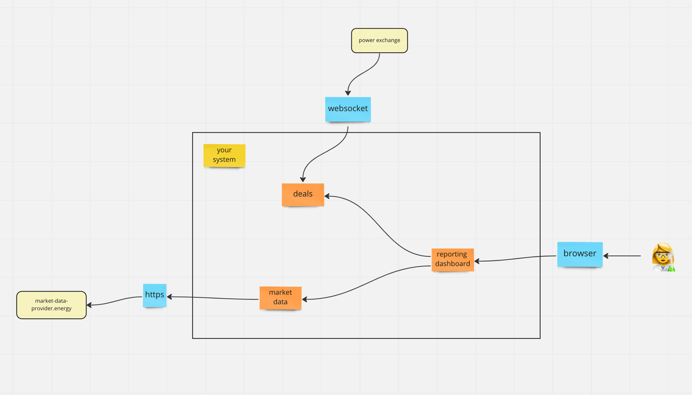

# System Design Challenge: A reporting system

## Goal
The trading team needs to visualise metrics about their trading activities on the power exchanges. 

Their job requires an instant feedback loop so that they can validate their assumptions on the state of market and  adjust their strategies in case their theories are incorrect.

## Trading@FlexPower
The trading team has 5 members but might go up to 15 over the next couple of years.
They trade on one exchange at the moment but we plan to expand to a couple of exchanges in the future.

The team has mixed levels of experience, with some traders doing this for over a decade and some that just started learning the craft.


## Trades
A trade is a confirmation of a match between a buyer and a seller (i.e. if the price offered by a buyer is higher than the price requested by a seller for energy over a given delivery range). 

The exchange sends a copy of the trade to both counterparties. These items are pushed to us from the exchange through a websocket connection. 

As soon as one of our traders, for example trader_1, matches another order, we get a confirmation from the exchange formatted in json.
Assume she buys 12.3 megawatt within the hour 8 to 9 for 20.5 euros/megawatt-hour, then we get the following message:
```json
{
  "trade_confirmation": 
    {
      "id": "123",
      "price": 20.5,
      "quantity": 12.3,
      "direction": "buy",
      "delivery_day": "2023-02-06",
      "delivery_hour": "08-09",
      "trader_id": "trader_1",
      "execution_time": "2023-02-06T06:13:45Z"
    }
}
```

Trades are the most important piece of data for our operation, they are the only way for us to keep track of the quantities we are trading. It is essential that we maintain an open connection to the exchange at all times so that we don't miss any.

We can receive up to a 100 trades per minute at the moment.


## Reference Price

We have a third party data provider for all types of market data. 

For the purposes of this task, we are only interested in the so called **reference price**, which is the average price for a megawatthour sold on the exchange for a given hour.

To access the data, the provider offers an API, with the following entrypoint:

```yaml
swagger: "2.0"
info:
  title: Market Data API
  version: 1.0.0
host: market-data-provider.energy
basePath: /v1
schemes:
  - https
paths:
  /reference-price:
    get:
      summary: Reference price.
      parameters:
        - in: query
          name: delivery_day
          required: true
          type: string
          example: "2023-02-06"
        - in: query
          name: delivery_hour
          required: true
          type: string
          example: "12-13"
      produces:
        - application/json
      responses:
        200:
          description: A data object.
          schema:
            type: object
            properties:
              delivery_day:
                type: string
                example: "2023-02-06"
              delivery_hour:
                type: string
                example: "12-13"
              value:
                type: float
                example: 100.0
              unit:
                type: string
                example: euro
              last_update:
                type: string
                example: "2023-02-06T09:15:45Z"
```
The reference prices are updated every 10 minutes until the beginning of the delivery hour. The updates are sometimes published with some delay, usually something between 0 and 30 seconds but without any clear patterns.

Once the price is available for one delivery hour, it's available for the rest of the tradable hours (That is until the end of the same day).

There is a limit on the number of requests we can submit to the API, about 50 per minute and 1000 per hour.

## Reporting:

The reporting frontend displays the following dashboard:


It can be accessed by the traders from their browsers. Since this is the traders' main source of validation, they might get impatient around the time the reference price is supposed to be published and start massively refreshing their reporting dashboard.


## What is expected:
This is an open problem, it describes the environment in which this system evolves, the different interfaces with the 
rest of the world and the functional outcome that we need to achieve. In architectural terms, this would be a black box view:


In other words, we don't have any particular solution in mind and there is no right or wrong answer, we are looking forward to hear how you would design this system and have a technical discussion about it.
 
Most of this is inspired by actual features and problems we had to or still have to solve, hopefully with your help.

Some aspects that we are particularly interested in are:
- which components would you need? How do you decide on the boundaries between these components?
- which databases or any other data management systems would you need?
- how would these components communicate with each other?
- which technologies would you use for each component and why?
- How and where would you run such a system in the cloud? Which services would you use?
- How would you manageme updates and deployments in such a system?
- How would you structure logging and monitoring?
- Anything else that you think is relevant!

Please take some time to prepare an overview of your solution, we really like to use [miro](https://miro.com) as a digital whiteboard, but feel free to chose any medium you prefer.

We hope this challenge has peaked your interest and that you will have fun solving it!

