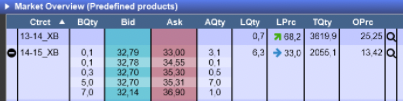

# System Design Challenge: A reporting system

## Goal
Our trading team needs to visualise metrics about their trading activities on the power exchanges. 

Their job requires an instant feedback loop so that they can validate their assumptions on the market and adjust their strategies in case their theories are incorrect.

## Energy Trading in a Nutshell
Energy trading happens within an **exchange**, a commodity market where traders working for energy producers 
and consumers place orders to buy and sell energy. One of the major exchanges in Europe is called [**EPEX**](https://en.wikipedia.org/wiki/European_Power_Exchange).

Producers can be either renewables like solar or wind assets or conventional like gas and coal. Consumers might include B2C energy providers or heavy industry.

An order consists of a quantity (in MW, short for Megawatt) over a predefined period of
time in the future, called **delivery range**, and for a given price (in euro/MWh, short for euro per megawatt hour). Orders on the EPEX can be submitted through a desktop application.

You can trade electricity for a given delivery range up to a certain point in time, called **gate closure** that is always prior to the **delivery start**. At a given point the delivery range available for trading goes up to the end of the next day.

For example at 2023-03-10 10:31 I can trade every hour starting with 2023-03-10 11:00 and up to and including 2023-03-11 23:00 (This is an approximation for the purpose of this challenge, the reality is a bit more complex unfortunately).

Orders for a given delivery range are structured within orderbooks divided in bid (buy orders) and ask (sell orders).




If two orders **match** (i.e the buyer is offering a higher price than the seller), a **trade** is generated by the exchange and a copy is sent to both **counterparties**. 

For example if the orderbook contains an order to sell 10 MW for 10 euro/MWh and another trader 
submits an order to buy 5 MW for 11 euro/MWh, the orders are matched by the exchange and a trade is 
generated for 5 MW at 10 euros/MWh.

## Trading@FlexPower
Our trading team's mission is to bring the energy produced by our 100% renewables portfolio to the exchange in a financially efficient way.
The team has 5 members but given the right conditions, it might go up to 15 over the next couple of years.
They trade energy in one country at the moment but we plan to expand to a couple of european countries in the future.

The team has mixed levels of experience, ranging from traders that have been doing this for over a decade to some that are learning the craft.

## Trades
Trades are pushed to us from the exchange through a websocket connection. 

As soon as one of our traders matches another order, we get a confirmation from the exchange formatted in json.
Assume she buys 12.3 MW within the hour 8 to 9 for 20.5 euro/MWh, then we get the following message:
```json
{
  "trade_confirmation": 
    {
      "id": "123",
      "price": 20.5,
      "quantity": 12.3,
      "direction": "buy",
      "delivery_day": "2023-02-06",
      "delivery_hour": "08-09",
      "trader_id": "trader_1",
      "execution_time": "2023-02-06T06:13:45Z"
    }
}
```

Trades are the most important piece of data for our operation, they are the only way for us to keep track of the quantities we are trading. We can receive up to a 100 trades per minute at the moment.


## Reference Price

We have a third party data provider for all types of market data. 

For the purposes of this task, we are only interested in the so called **reference price**, which is the average price for a megawatthour sold on the exchange for a given hour.

To access the data, the provider offers an API, with the following entrypoint:

```yaml
swagger: "2.0"
info:
  title: Market Data API
  version: 1.0.0
host: market-data-provider.energy
basePath: /v1
schemes:
  - https
paths:
  /reference-price:
    get:
      summary: Reference price.
      parameters:
        - in: query
          name: delivery_day
          required: true
          type: string
          example: "2023-02-06"
        - in: query
          name: delivery_hour
          required: true
          type: string
          example: "12-13"
      produces:
        - application/json
      responses:
        200:
          description: A data object.
          schema:
            type: object
            properties:
              delivery_day:
                type: string
                example: "2023-02-06"
              delivery_hour:
                type: string
                example: "12-13"
              value:
                type: float
                example: 100.0
              unit:
                type: string
                example: euro
              last_update:
                type: string
                example: "2023-02-06T09:15:45Z"
```

The reference prices for each delivery hour are updated every 10 minutes until gate closure. The updates are sometimes published with some delay, usually something between 0 and 30 seconds but without any clear patterns.

Once the price is available for one delivery hour, it's available for the rest of the tradable hours (That is until the end of the same day).

There is a limit on the number of requests we can submit to the API, about 50 per minute and 1000 per hour.

## Reporting:

The reporting frontend displays the following dashboard:


It can be accessed by the traders from their browsers. Since this is the traders' main source of validation, they might get impatient around the time the reference price is supposed to be published and start massively refreshing their reporting dashboard.


## What is expected:
This is an open problem, it describes the environment in which this system evolves, the different interfaces with the 
rest of the world and the functional outcome that we need to achieve. In architectural terms, this would be a black box view:


In other words, we don't have any particular solution in mind and there is no right or wrong answer, we are looking forward to hear how you would design this system and have a technical discussion about it.
 
Most of this is inspired by actual features and problems we had to or still have to solve, hopefully with your help.

Some aspects that we are particularly interested in are:
- which components would you need? How do you decide on the boundaries between these components?
- which databases or any other data management systems would you need?
- how would these components communicate with each other?
- which technologies would you use for each component and why?
- How and where would you run such a system in the cloud? Which services would you use?
- How would you manageme updates and deployments in such a system?
- How would you structure logging and monitoring?
- Anything else that you think is relevant!

Please take some time to prepare an overview of your solution, we really like to use [miro](https://miro.com) as a digital whiteboard, but feel free to chose any medium you prefer.

We hope this challenge has peaked your interest and that you will have fun solving it!

